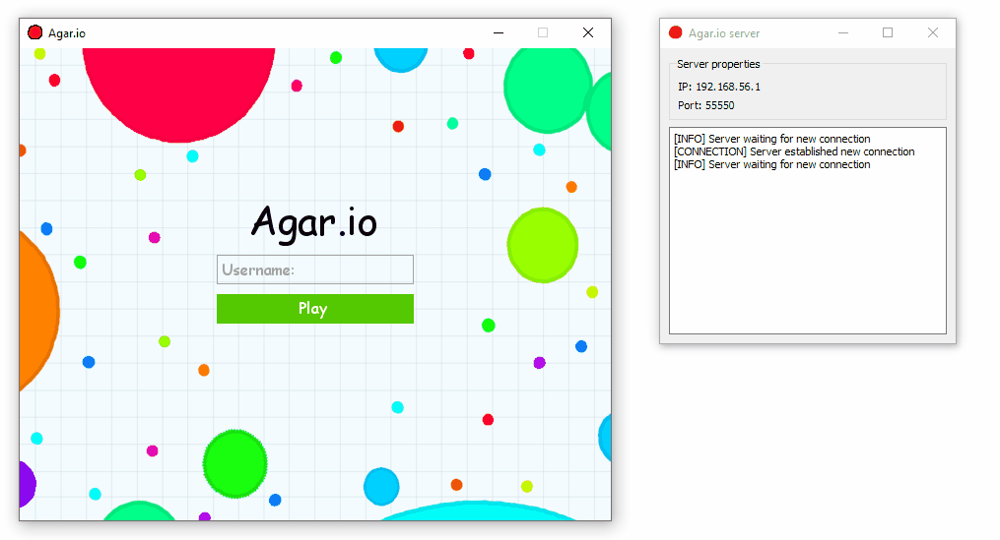

<a name="readme-top"></a>


<!-- PROJECT LOGO -->
<br />
<div align="center">
  
  <h3 align="center">Agar-Io</h3>
  <p align="center">
    An awesome dependency information gatherer!
    <br /><br />
  </p>
</div>


<!-- TABLE OF CONTENTS -->
<details>
  <summary>Table of Contents</summary>
  <ol>
    <li>
      <a href="#about-the-project">About The Project</a>
      <ul>
        <li><a href="#built-with">Built With</a></li>
      </ul>
    </li>
    <li>
      <a href="#getting-started">Getting Started</a>
      <ul>
        <li><a href="#installation">Installation</a></li>
      </ul>
    </li>
    <li><a href="#usage">Usage</a></li>
    <li><a href="#license">License</a></li>
    <li><a href="#acknowledgments">Acknowledgments</a></li>
  </ol>
</details>


<!-- ABOUT THE PROJECT -->
## About The Project

This repository contains a Python pygame app that is a clone of the popular game agar.io. The game was originally developed as a side project during the BSc degree studies in IT engineering. The game features include controlling a cell using WASD or arrow keys, displaying a username for each cell, eating food and other players to grow your character, and a dynamic leaderboard in the top right corner.

The game logic is handled by the server, while the client side is used only for rendering game components. In addition, the repository includes a bot that can be launched from the server to detect and attack other players. The bot features include detecting the nearest food from the current position, gathering food when the radius is less than 10, looking for the nearest player when the radius is more than 10, performing an attack if the player is close enough, and going back to collecting food after a collision with another player.

<p align="right">(<a href="#readme-top">back to top</a>)</p>


### Built With

![Python][Python-url]
![Pygame][Pygame-url]

<p align="right">(<a href="#readme-top">back to top</a>)</p>


<!-- GETTING STARTED -->
## Getting Started

To get a local copy up and running follow these simple steps.

### Installation

1. Clone the repo
   ```sh
   git clone git@github.com:kamillobinski/agar-io.git
   ```

2. Install the required packages
   ```sh
   pip install pygame PyQt5
   ```

3. Set your IP address in `server.py` and `client.py` files
   ```python
   self.host = '192.168.0.1'
   ```

4. Run server and client
   ```sh
   python server.py
   python client.py
   ```

<p align="right">(<a href="#readme-top">back to top</a>)</p>


<!-- USAGE -->
## Usage

Here is a preview of the game:



<p align="right">(<a href="#readme-top">back to top</a>)</p>


<!-- LICENSE -->
## License

Distributed under the Apache 2.0 License. See `LICENSE.txt` for more information.

<p align="right">(<a href="#readme-top">back to top</a>)</p>


<!-- ACKNOWLEDGMENTS -->
## Acknowledgments

I would like to thank the developers of pygame, as well as the creators of agar.io for inspiring this project. I would also like to express my gratitude to my professors and colleagues during my BSc degree studies in IT engineering for their support and feedback during the development of this game.

* [Agar.io](https://agar.io/)

<p align="right">(<a href="#readme-top">back to top</a>)</p>


<!-- MARKDOWN LINKS & IMAGES -->
[Python-url]: https://img.shields.io/badge/Python-0769AD?style=for-the-badge&logo=python&logoColor=white
[Pygame-url]: https://img.shields.io/badge/Pygame-%23F7DF1E.svg?style=for-the-badge&logo=pygame&logoColor=black